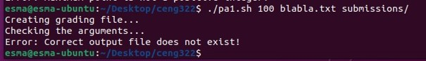
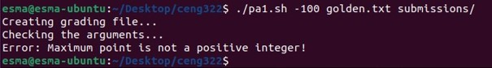
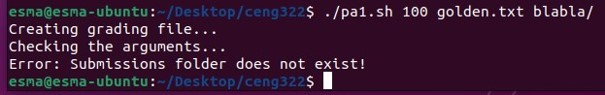
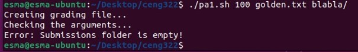
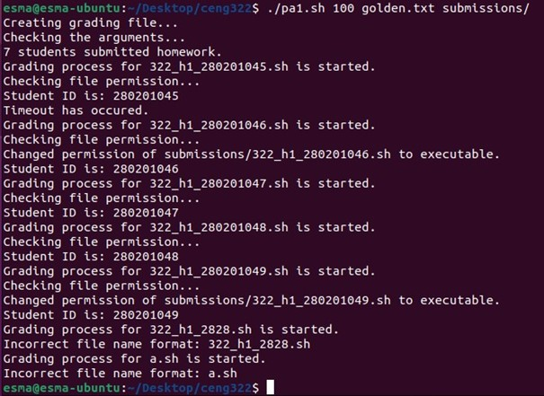
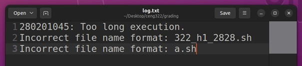
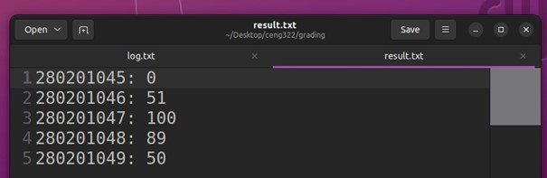

This shell  script  grades the shell script assignments  of students.  The assumptions and requirements are as follows: 
- ### The arguments  passed should be in the following format  for the script to be able to run properly: 

  ```
  ./script.sh max_grade expected_output.txt submissions/
  ```
  - **max\_grade**: The maximum grade that a student can take.
  - **expected\_output.txt**: The text file containing the expected output of the shell script assignment. 
  - **submissions/**: The folder containing the assignment submissions of the students. 

- ### The script returns error messages in the following situations:
  - If the first argument is not a positive integer. 
  - If the file in second argument does not exist.
  - If the folder in the third argument  does not exist or is empty. 

- ### The grading policy is as follows: 
  - If the name of the submitted file is not in the “322\_h1\_x.sh” format  (where x is a 9-digit number representing student ID), submission is not evaluated. 
  - If the execution of the submitted script takes longer than 1 minute, the grade is assigned 0. 
  - Else, the output of submitted script is compared to the expected  output and the grade is calculated as “maximum  grade  – number  of differing lines in output”. (It is assumed that the number of lines in expected output is the same  as the maximum  grade.) 

- ### It is assumed that the shell script is in the same directory with ***expected_output.txt*** and ***submissions/*** folder. After running,  the script creates a directory named “grading” under the same  directory, and  creates following files under grading directory: 
  - **log.txt** file which holds the log of submissions which have incorrect file name format and submissions  which a timeout occurs during the execution. 
  - **result.txt** which holds the grades of the evaluated submissions. 
  - One output  file for each evaluated submission in **“322\_h1\_x\_out.txt”** format. 

Example  Runs: 

- With wrong argument  formats:

  

  

  

  

- With timeout, incorrect file name format,  correct submissions and change permission 

  

  After this run,  contents of the log.txt and result.txt files are as follows:

  

  
